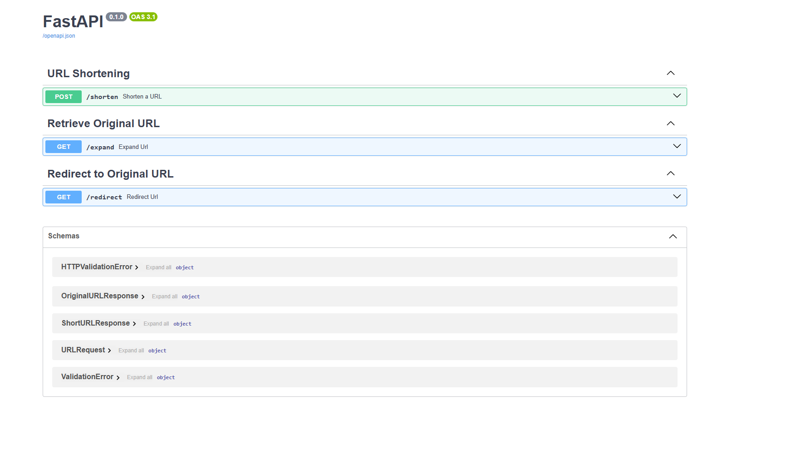

# Actuate Coding Exercise

## Overview

This project is a URL shortening service built with FastAPI. It allows users to shorten long URLs, expand shortened URLs back to their original form, and redirect to the original URLs using the shortened URLs.




## Technologies/Libraries Used

- **FastAPI**: Provides great documentation using SwaggerUI and integration with Pydantic models for type safety and async functionality.
- **Pydantic**: Eases user input validation. Has various data types such as `HttpUrl`, `Datetime`, as well as functionality to create custom data types using field validators.
- **SQLite3**: Easy to use database for prototyping and development purposes.
- **Docker**: Containerization platform to package the application and its dependencies. Easy to run and test

## APIs
### Shorten URL

**Endpoint**: `/shorten`

**Method**: `POST`

**Description**: Takes a long URL and returns a shortened URL.

**Request Body**:
```json
{
    "url": "string"
}
```

**Response**:
```json
{
  "short_url": "string",
  "expiry_date": "string",
  "status_code": 200
}
```

### Redirects to Original URL

**Endpoint**: `/redirect/{shortened_url}`

**Method**: `GET`

**Description**: Redirects to the original long URL based on the shortened URL and updates the click value as well.

**Response**: Redirects to the original URL.

### Get Original URL

**Endpoint**: `/expand/{shortened_url}`

**Method**: `GET`

**Description**: Retrieves details about the URL, such as the original URL, URL Expiry and clicks on the URL. 

**Response**:
```json
{
  "original_url": "https://example.com/",
  "short_url": "string",
  "expiry_date": "string",
  "clicks": 0,
  "status_code": 200
}
```

## Instructions to Run

### Using Docker

1. **Build the Docker image**:
    ```docker build --pull --rm -t 'actuate:latest' '.' ```

2. **Run the Docker container on port 8000**:
    ```docker run --rm -d -p 8000:8000/tcp actuate:latest ```

3. **API Documentation and Testing**:
    You can access the API documentation at `http://localhost:8000/docs`.

    You can alternatively test using Postman as well


## Features
1. Added Validation for Input to the APIs using Pydantic Models which provide constraints as well as Fast API features for input validation
2. Added custom error messages and logging for better observability
3. Used SHA-256 upto 9 characters. It is fast and simple for URL shortener. But we should be handling collisions. I have made the fields unique to ensure no duplicates exists. But collision has to be handled on API level as well. For small scale of few thousands or hundred thousands there are very less chances of collision but their might be chances when it comes to millions or biliions of records.
## Scope for Improvement

1. Handle collision
2. Caching of frequently accessed URLs
3. Adding rate limiter for production use for security purpose
4. Remove the expired URLs from database using a scheduler or whenever the user will first time query the URL after it has expired.